# mx-ms-bc-mulesoft-archetype-template
Plantilla para proyectos MuleSoft

## Descripción
Este arquetipo de MuleSoft proporciona una estructura estandarizada y configuraciones predefinidas para el desarrollo de integraciones y APIs. Está diseñado para fomentar buenas prácticas de desarrollo, facilitar la gestión de configuraciones entre diferentes entornos, y asegurar la consistencia y calidad del código en proyectos Mule. Además, puedes descargar y utilizar este arquetipo fácilmente desde Maven.

## Características
- Estructura estandarizada
- Configuraciones predefinidas
- Buenas prácticas de desarrollo
- Gestión de configuraciones entre entornos
- Consistencia y calidad del código

## Requisitos
- MuleSoft Anypoint Studio 7.14 o superior
- Mule Runtime 4.6.6 LTS
- Java JDK 17

## Instalación

1. Generar el arquetipo
    ```
    .\config.bat 834f46f4-ef08-4c50-81ae-56f917b413cc 1.0.0-SNAPSHOT
    .\config.bat ${groupId} ${version}
    ```

2. Limpiar el proyecto antes de actualizar el arquetipo
    ```
    .\clean.bat
    ```

3. Importa el proyecto en Anypoint Studio.


## Uso
1. Despliega la aplicación en Mule Runtime.
2. Accede a las APIs y servicios según la documentación proporcionada.


## Características Principales:
- Estructura de Proyecto Estándar: Organización clara de carpetas para flujos, configuraciones, recursos y pruebas.
- Nomenclatura Consistente: Recomendaciones para nombres de flujos, variables y transforms, asegurando claridad y mantenibilidad tomando en cuenta la arquitectura BIAN

- Plantillas para Manejo de Errores: Flujos preconfigurados para la gestión centralizada de excepciones.

- Integración con CI/CD: El arquetipo ya cuenta con las configuraciones para realizar una integración CICD, estas se encuentran en el pom.xml, las cuales son las siguientes

```xml
// pom.xml
    <!-- 1 ==== Poner el esta etiqueta para el nombre de tu proyecto a desplegar en el Runtime Manager -->
    <project.mule.name>mx-ms-bc-mulesoft-template</project.mule.name>
    <!-- 1 ==== Poner el esta etiqueta para el nombre de tu proyecto a desplegar en el Runtime Manager -->


    <!-- 2 ==== Poner por default este groupId el cual es referencia a la organización Unity -->
	<groupId>834f46f4-ef08-4c50-81ae-56f917b413cc</groupId>
	<!-- 2 ==== Poner por default este groupId el cual es referencia a la organización Unity -->

    <!-- 3 ==== Configuraciones para Cloudhub 2 -->
        <cloudhub2Deployment>
            <uri>https://anypoint.mulesoft.com</uri>
            <provider>MC</provider>
            <environment>${environment}</environment>
            <businessGroupId>${businessGroupId}</businessGroupId>
            <target>${target}</target>
            <muleVersion>${app.runtime}</muleVersion>
            <server>anypoint-exchange-v3</server>
            <connectedAppClientId>${connectedAppClientId}</connectedAppClientId>
            <connectedAppClientSecret>${connectedAppClientSecret}</connectedAppClientSecret>
            <connectedAppGrantType>client_credentials</connectedAppGrantType>
            <applicationName>${project.mule.name}</applicationName>
            <replicas>${replicas}</replicas>
            <vCores>${vCores}</vCores>
            <deploymentSettings>
                <lastMileSecurity>false</lastMileSecurity>
                <forwardSslSession>false</forwardSslSession>
                <generateDefaultPublicUrl>true</generateDefaultPublicUrl>
            </deploymentSettings>
            <properties>
                <mule.env>${mule.env}</mule.env>
            </properties>
            <releaseChannel>LTS</releaseChannel>
            <javaVersion>8</javaVersion>
        </cloudhub2Deployment>
    </configuration>
    <!-- 3 ==== Configuraciones para Cloudhub 2 -->


    <!-- 4 ==== Configuraciones para Cloudhub 2 Exchange -->
    <repository>
        <id>PrivateExchangeRepository</id>
        <name>Private Exchange repository</name>
        <url>https://maven.anypoint.mulesoft.com/api/v3/organizations/${orgId}/maven</url>
        <layout>default</layout>
    </repository>
    <!-- 4 ==== Configuraciones para Cloudhub 2 Exchange -->

    <!-- 5 ==== Configuraciones para Cloudhub 2 comunicacion con Exchange -->
    <distributionManagement>
        <repository>
            <id>anypoint-exchange-v3</id>
            <name>Corporate Repository</name>
            <url>https://maven.anypoint.mulesoft.com/api/v3/organizations/${businessGroupId}/maven</url>
            <layout>default</layout>
        </repository>
    </distributionManagement>
    <!-- 5 ==== Configuraciones para Cloudhub 2 comunicacion con Exchange -->
```

# Nomenclatura

La nomenclatura en MuleSoft es clave para mantener la claridad y la consistencia en los proyectos. Aquí te doy algunas recomendaciones específicas para nombres de flows, variables y transforms:

### Estandarización 
Usa nombres que reflejen claramente la funcionalidad del flow. Empieza con un verbo para indicar la acción que realiza.

* Ejemplos:
    * {data-name}-retrieve-client: Para un flujo que contiene el request que recupera datos.
    * {data-name}-evaluate-client: Para un flujo que contiene el request que evalua datos.

        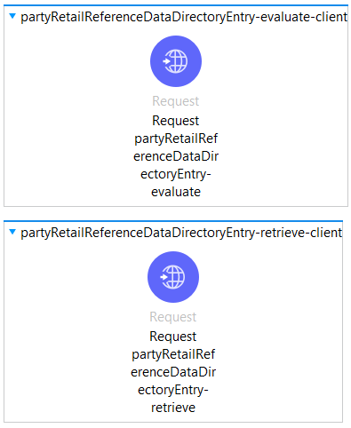

### Nombres de Variables
Prefijos Consistentes: Usa prefijos que indiquen el tipo de datos o el propósito de la variable.
var, payload, headers, params, session, inbound para variables generales.

* Ejemplos:
    * varCustomerName
    * payloadOrderId
    * headersAuthToken

### Claridad y Descriptividad
Asegúrate de que el nombre de la variable sea descriptivo para evitar confusiones.
* Ejemplos:
    * varTotalAmount
    * payloadInvoiceDetails

### Evitar Abreviaciones
Usa nombres completos para mantener la claridad, evitando abreviaciones que puedan ser confusas.

* Ejemplo:
    * varUserIdentifier en lugar de varUsrId

### Nombres de Transforms
El componente Transform Message debe ser nombrado como el mapeo request destino que nos indican en el documento de contrato.

   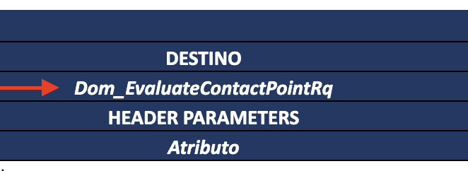


#### Contexto de la Transformación: 
En el caso que se realice una conversión del tipo de formato de entrada al tipo de formato de salida usa nombres que describan tanto la entrada como la salida del transform.

* Ejemplos:
    * jsonToJava{nombre del Transform Message}
    * csvToJson{nombre del Transform Message}

### Nombres para definir los metadata
Realice el nombrado de los archivos conforme al origen y destino definido en el documento de contrato, ubicarlo en la carpeta de la API que se está trabajando.

| origen | destino | ubicación |
| --- | --- | --- |
| 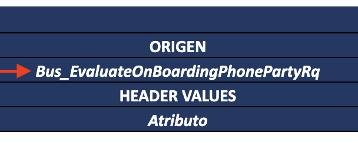 |  |  |

## Recomendaciones
### Consistencia
Define una convención de nombres y úsala de manera consistente en todo el proyecto.

### Documentación
Incluye comentarios en los transforms y variables clave para explicar su propósito si el nombre por sí solo no es suficiente.

### Prefijos y Sufijos
Considera estandarizar el uso de prefijos como retrieve, validate, process, y sufijos como -client, -handler, -orchestrator, -td0001 para mantener una estructura clara.

# MuleSoft Project

Este proyecto es un arquetipo base para la gestión del ciclo de vida de clientes utilizando MuleSoft. Está estructurado para facilitar el desarrollo modular y seguir buenas prácticas de arquitectura, asegurando escalabilidad y mantenimiento a largo plazo.

# Estructura del Proyecto

La estructura del proyecto está organizada en módulos para garantizar la separación de responsabilidades:

```plaintext
mx-ms-bc-mulesoft-archetype-template
│
├── src/main/mule (Flows)
│   ├── mulesoft-archetype-template.xml
│   ├── client
│   │   └── partyRetailReferenceDataDirectoryEntry-client.xml
│   ├── common
│   │   ├── commons.xml
│   │   ├── error-handler.xml
│   │   ├── global-config.xml
│   │   └── validate-token.xml
│   ├── handler
│   │   └── partyRetailReferenceDataDirectoryEntry-handler.xml
│   └── orchestrator
│       ├── partyRetailReferenceDataDirectoryEntry-evaluate-orchestrator.xml
│       └── partyRetailReferenceDataDirectoryEntry-retrieve-orchestrator.xml
├── src/main/java
├── src/main/resources
│   │   ├── dwl (Transformaciones dataweave)
│   │   └── properties (solo contener los elementos de properties (loca, dev, qa, prod))
├── src/test
│   ├── munit (Pruebas Unitarias)
│   └── resources (Recursos de las Pruebas Unitarias)
├── README.md (Este archivo)
├── mule-artifact.json (Configuración del Proyecto Mule)
└── pom.xml (Configuración de Maven)
```

## Descripción de los Módulos

### client/
Este módulo contiene los flujos relacionados con la gestión del cliente. Aquí se procesan las solicitudes principales para el ciclo de vida de clientes.

* partyRetailReferenceDataDirectoryEntry-client.xml: Este archivo define los subflujos que manejan las solicitudes hacia capas posteriores, como proxies, sistemas legados o servicios web. Es importante tener en cuenta que si un recurso proxy tiene múltiples operaciones, todas deben ser incluidas en un único archivo en diferentes subflujos. Por ejemplo, si un recurso proxy tiene dos o más operaciones, cada una de ellas debe estar representada en un subflujo dentro del mismo archivo.

    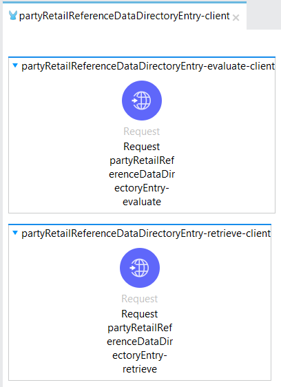


* commons.xml: Contiene subflujos que realizan la validación de headers, token y payloads. Mismas que se realizan en cualquier petición

    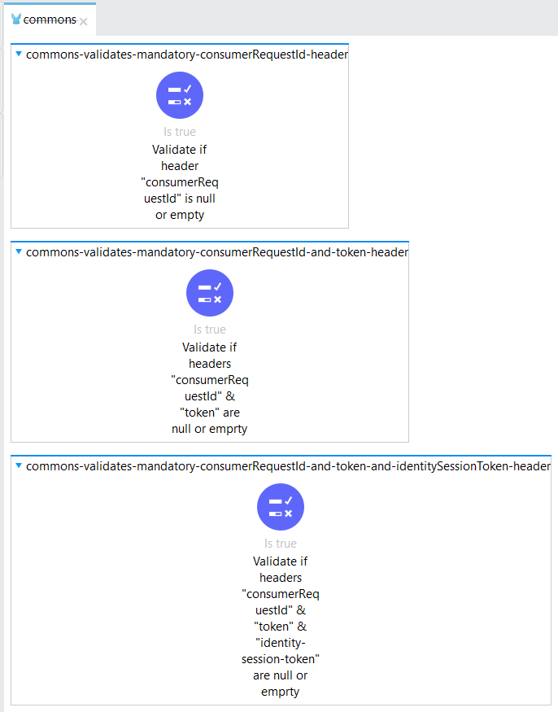


* error-handler.xml: Contiene los manejadores de errores a los que se dirigirá el flujo de cualquier petición que fallé

    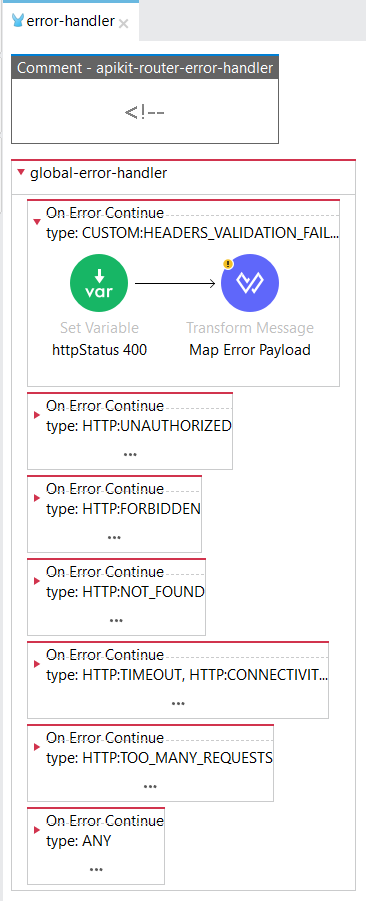

    (El manejador "apikit-router-error-handler" está comentado porque va a depender de la especificación que se importe al proyecto)


* global-config.xml: Almacena configuraciones globales que se aplican en todo el proyecto.
    * Ejemplo:
        * Request
        * Variables Globales
        * Configuraciones de conectores
        * etc

        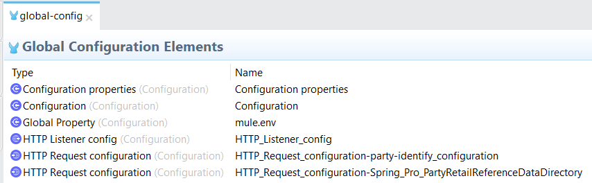


* validate-token.xml: Flujo que realiza la validación del token recibido en los headers con un recurso adicional llamado "party identity". En el cual si el token es correcto continúa con el flujo de la api. Pero si el token es incorrecto, se detendrá el flujo y recibiremos un error 401 con un mensaje de "No Autorizado"

    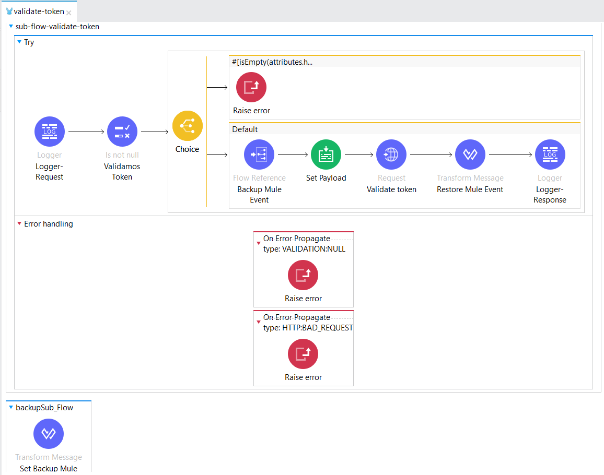


### handler/
El handler centraliza y recibe las solicitudes HTTP entrantes (GET, POST, PUT, DELETE, etc.) enviadas a la API.

common-error-handler.xml: Define cómo se manejan los errores de manera consistente en todos los flujos.

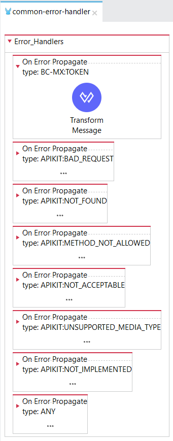

Debes configurar todos los errores que detectes que puedan ocurrir, y dentro del transform hay que configurar el mensaje y código de salida según las conveniencias del proyecto. ¡Ojo! Es importante que los errores configurados sean "On error propagate"
```dwl
// ejemplo de transform correspondiente al error 400
    %dw 2.0
    output application/json
    ---
    {
        "statusCode" : "400",
        "status" : "FAILED",
        "message": error.description,
    }
```
Tambien es importante que el flujo principal haga referencia a este manejador de errores que se acaba de configurar

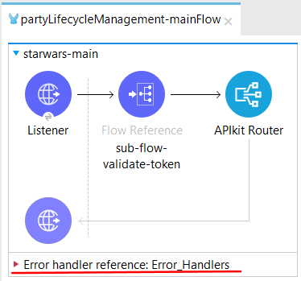

partyLifecycleManagement-handler.xml: Este archivo capturamos todos aquellos valores que podemos utilizar en el Mule Event (payload, variables, uri parameters, query parameters, etc). Es importante tener en cuenta que si un recurso proxy tiene múltiples operaciones, todas deben ser incluidas en un único archivo. Por ejemplo, si un recurso proxy tiene tres operaciones, cada una de ellas debe estar representada en un subflujo dentro del mismo archivo.

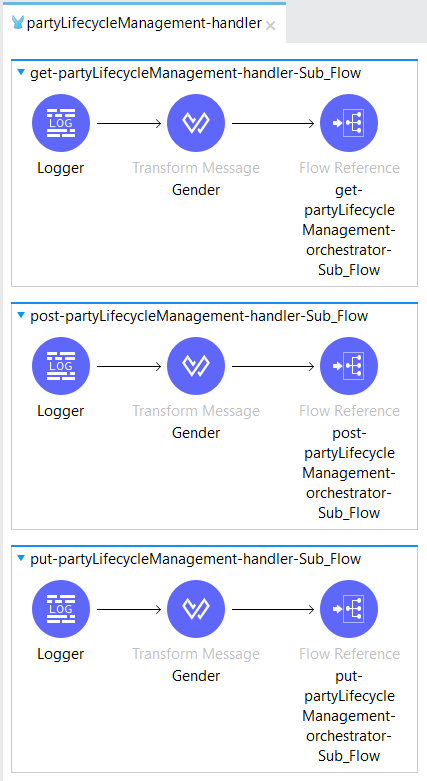

### orchestrator/
Orquesta la integración entre distintos sistemas dentro del ciclo de vida del cliente.
En esta capa se debe generar un archivo por recurso y debe contener un sub flujo principal que orquesta los diferentes steps que se definen en el diagrama de secuencia en el documento de transformación.

partyLifecycleManagement-client-orchestrator.xml: Coordina flujos complejos que involucran diferentes sistemas.

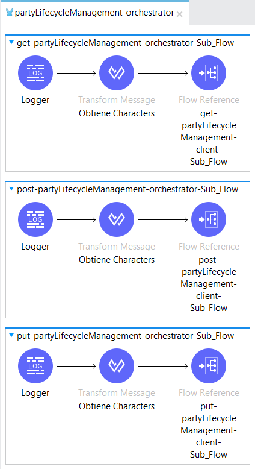

Ejemplo de flujos de acuerdo al diagrama de secuencia.


### Pruebas Unitarias (MUnit)
Las pruebas están configuradas en el directorio src/test/munit. Cada flujo crítico debe tener sus correspondientes casos de prueba, verificando tanto los casos de éxito como el manejo de errores.

##### Ejemplo
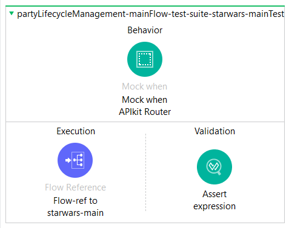

Los principales elementos que usamos para definir una prueba son:

#### behavior: Define el comportamiento simulado de un componente o servicio.
#### execution: Define la ejecución del flujo que se está probando.
#### validation: Verifica que los resultados de la ejecución coincidan con lo esperado.

**Es esencial que las pruebas cubran tanto los casos de éxito (cuando todo se ejecuta como se espera) como los casos de error (cuando ocurren fallos o condiciones inesperadas)**

### Dependencias
Este proyecto incluye las siguientes dependencias importantes:

MuleSoft APIKit: Para el desarrollo basado en APIs y validación de RAML
JDK 17 (Embedded): Se utiliza Java 17 como versión del JDK.
Runtime Manager: Se realizo una actualización y mejora en el Runtime manager utilizando la versión 4.6.6 LTS la cual cuenta con un periodod prolongado de soporte: https://docs.mulesoft.com/release-notes/runtime-fabric/runtime-fabric-runtimes-release-notes

| Mule Version | Release Date | Java Version | End of Standard Support | End of Extended Support |
|--------------|--------------|--------------|--------------------------|--------------------------|
| 4.3 Edge     | April 2020   | 8            | March 2023               | March 2025               |
| 4.4 Edge     | September 2021 | 8            | October 2024             | October 2025             |
| 4.5 Edge     | October 2023 | 8            | February 2024            | June 2024                |
| 4.6 LTS      | February 2024 | 8 and 17     | February 2025            | February 2026            |
| 4.6 Edge     | February 2024 | 8 and 17     | June 2024                | October 2024             |
| 4.7 Edge     | June 2024    | 8 and 17     | October 2024             | February 2025            |
| 4.8 Edge     | October 2024 | 8 and 17     | February 2025            | June 2025                |
| 4.9 LTS      | February 2025 | 17           | February 2026            | February 2027            |
| 4.9 Edge     | February 2025 | 17           | June 2025                | October 2025             |

### Logs

Una buena estrategia de logging es crucial para la depuración, monitoreo y mantenimiento del sistema. 

Uso de Niveles de Log Apropiados:

* ERROR: Para errores críticos que afectan el funcionamiento del sistema.
* WARN: Para advertencias que no son errores pero que pueden indicar problemas potenciales.
* INFO: Para información general sobre el flujo del proceso, como el inicio y fin de flujos importantes.
* DEBUG: Para información detallada utilizada durante el desarrollo y la depuración. Úsalo con moderación en producción.

Estructuración de Mensajes de Log:

Asegúrate de que los mensajes sean claros y útiles. Incluye información relevante como el nombre del flujo, el identificador de la transacción, y cualquier otro contexto necesario para entender el mensaje.

Manejo de Datos Sensibles:

Asegúrate de que los logs no contengan datos sensibles o personales para cumplir con las normativas de privacidad.
